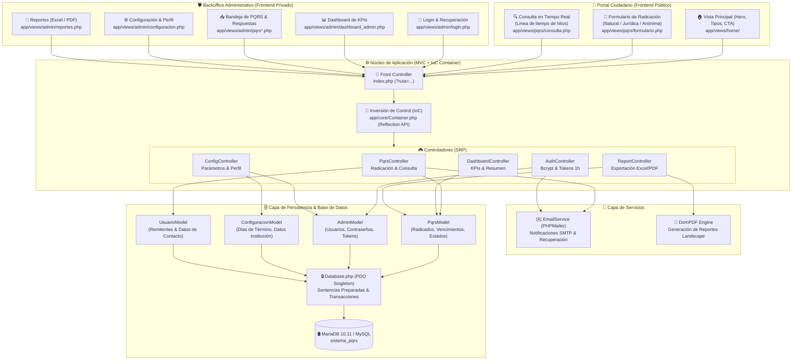
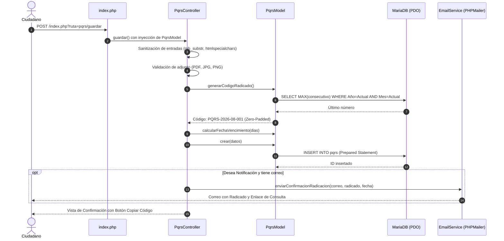
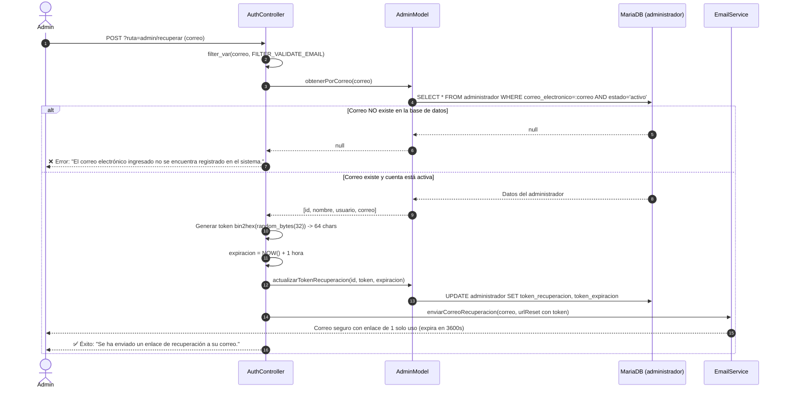
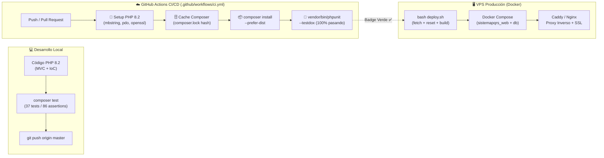

# 🏗️ Arquitectura y Seguridad del Sistema PQRS (v1.4.0)

Este documento valida formalmente las decisiones de arquitectura de software, patrones de diseño, flujos de persistencia, controles de seguridad e integración continua implementados en el **Sistema de Gestión de PQRS** bajo la normativa de Colombia (Ley 1755 de 2015 y Ley 1437 de 2011).

---

## 1. Diagrama de Componentes y Responsabilidades



---

## 2. Matriz de Responsabilidades por Componente

| Capa | Componente | Principio SOLID | Responsabilidad Principal |
|------|------------|:---------------:|---------------------------|
| **Core** | `index.php` | OCP | Front Controller centralizado; resolución estricta de rutas |
| **Core** | `Container.php` | DIP | Inyección de dependencias recursiva mediante Reflection API de PHP |
| **Controlador** | `AuthController.php` | SRP | Autenticación con Bcrypt, sesiones blindadas y recuperación por tokens de 64 chars |
| **Controlador** | `PqrsController.php` | SRP | Radicación ciudadana, sanitización de archivos y consulta en tiempo real |
| **Controlador** | `DashboardController.php` | SRP | Cálculo de indicadores de rendimiento (KPIs), cumplimiento y estados |
| **Controlador** | `ConfigController.php` | SRP | Parametrización de días de vencimiento (1–30 días) y actualización de perfil admin |
| **Controlador** | `ReportController.php` | SRP | Generación y exportación de bitácoras en Excel y PDF horizontal |
| **Modelo** | `PqrsModel.php` | SRP | Consecutivo mensual `PQRS-AAAA-MM-NNN`, ciclo de vida y cálculo de vencimientos |
| **Modelo** | `AdminModel.php` | SRP | Consulta y actualización de credenciales, tokens temporales y último acceso |
| **Modelo** | `Database.php` | SRP | Conexión PDO Singleton con emulación desactivada y UTF-8mb4 estricto |
| **Servicio** | `EmailService.php` | DIP | Envío de correos SMTP (radicación, respuesta institucional y recuperación) |

---

## 3. Diagrama de Flujo: Radicación y Ciclo de Vida de PQRS



---

## 4. Diagrama de Seguridad: Recuperación de Contraseña con Validación en BD



---

## 5. Diagrama de DevOps e Integración Continua (CI/CD)



---

## 6. Suite de Pruebas Automatizadas (PHPUnit 10.5)

El sistema cuenta con **37 pruebas unitarias** y **86 aserciones** ejecutadas en menos de 0.7 segundos:

| Suite | Archivo | Pruebas | Alcance y Cobertura |
|-------|---------|:-------:|---------------------|
| **ContainerTest** | `tests/Unit/ContainerTest.php` | 6 | Inyección recursiva por Reflection API, singletons, control de clases abstractas y tipos primitivos |
| **AuthControllerTest** | `tests/Unit/AuthControllerTest.php` | 11 | Algoritmo Bcrypt, validación estricta de correo en tabla `administrador`, rechazo de correos no registrados, tokens de 64 chars y expiración en 3600s |
| **PqrsModelTest** | `tests/Unit/PqrsModelTest.php` | 11 | Formato `PQRS-AAAA-MM-NNN`, zero-padding, validación de 4 estados, 5 tipos de trámite y cálculo de vencimiento en días hábiles |
| **EmailServiceTest** | `tests/Unit/EmailServiceTest.php` | 9 | Configuración segura desde variables de entorno, validación de puertos SMTP, etiquetas en español y construcción de plantillas |

Para ejecutar localmente:
```bash
composer test          # Suite resumida
composer test-verbose  # Suite detallada con TestDox
```

---

## 7. Capa de Presentación Modular (CSS)

La hoja de estilos principal `public/css/estilos.css` actúa como orquestador limpio vía `@import` integrando 7 submódulos bajo `public/css/modules/`:

```text
public/css/
├── estilos.css           # Orquestador principal (@import)
└── modules/
    ├── variables.css     # Tokens de diseño, colores HSL/Hex, espaciado y sombras
    ├── base.css          # Reset universal, tipografía base y contenedores
    ├── layout.css        # Header sticky, footer corporativo, hero y CTA
    ├── components.css    # Botones interactivos, badges, cards, timeline y modal
    ├── forms.css         # Formularios de radicación, consulta y login
    ├── admin.css         # Dashboard de KPIs, métricas, filtros y reportes
    └── responsive.css    # Breakpoints 640px/768px/1024px y prefers-reduced-motion
```
