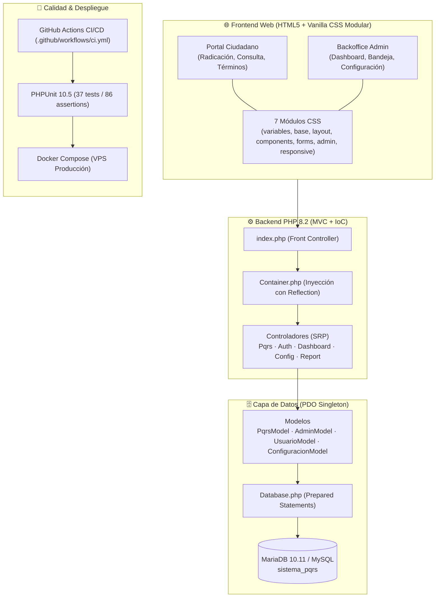

# Plan de Implementación — Sistema PQRS (v1.4.0)

Este documento describe la planificación técnica, fases de evolución, decisiones de arquitectura y el cronograma de madurez del **Sistema de Gestión de PQRS** bajo el marco legal de Colombia (Ley 1755 de 2015).

---

## 🎯 Objetivos de Ingeniería

1. **Atención Ciudadana Transparente:** Permitir radicación pública (Natural/Jurídica) o Anónima con generación de radicados únicos seriales (`PQRS-AAAA-MM-NNN`) y consulta en tiempo real.
2. **Backoffice de Alta Eficiencia:** Dotar a los administradores de un dashboard de métricas en tiempo real, trazabilidad de historial y respuestas formales con plantillas rápidas.
3. **Calidad y Mantenibilidad:** Arquitectura MVC desacoplada con IoC Container (Reflection API), suite unitaria de 37 tests (PHPUnit 10.5) y CI/CD con GitHub Actions.
4. **Diseño Modular y Adaptativo:** Separación de estilos en 7 módulos CSS independientes y responsivos sin dependencias externas pesadas.

---

## 🏗️ Diagrama de Fases y Roadmap

```mermaid
timeline
    title Hoja de Ruta y Madurez del Sistema PQRS
    section Fase 1 : MVC & Persistencia
        Modelado de Datos : Tablas usuario, administrador, pqrs, historial
        Patrón MVC : Front Controller index.php y separación SRP
        IoC Container : Inyección con Reflection API
    section Fase 2 : Docker & Resiliencia
        Docker Compose : PHP 8.2 FPM + Caddy/Nginx + MariaDB
        Variables de Entorno : Soporte agnóstico con EnvLoader.php
        Despliegue VPS : Script deploy.sh automatizado
    section Fase 3 : Calidad & DevOps (v1.4.0)
        PHPUnit 10.5 : 37 tests unitarios y 86 aserciones
        GitHub Actions : Pipeline CI/CD en PHP 8.2
        Modularización CSS : 7 módulos en public/css/modules/
        Validación BD : Control estricto de emails en recuperación
    section Fase 4 : Operación Continua
        Monitoreo VPS : Auditoría de logs y backups automatizados
        Seguridad de Correo : Servidor SMTP con TLS/SSL
```

---

## 🏛️ Diagrama de Componentes de la Solución



---

## 📊 Matriz de Trazabilidad y Verificación

| Componente | Requisito Legal / Técnico | Mecanismo de Verificación |
|------------|---------------------------|----------------------------|
| Radicado Único | Ley 1755 de 2015 | `PqrsModelTest::codigo_radicado_tiene_formato_correcto` |
| Términos de Respuesta | 15 días hábiles promedio | `PqrsModelTest::fecha_vencimiento_se_calcula_correctamente` |
| Seguridad en Login | Cifrado Bcrypt + CSRF | `AuthControllerTest::password_verify_acepta_hash_bcrypt_valido` |
| Recuperación de Clave | Tokens criptográficos de 1 hora | `AuthControllerTest::recuperar_consulta_correo_en_tabla_administrador` |
| Validación de Correo en BD | Verificación estricta en tabla `administrador` | `AuthControllerTest::recuperar_retorna_null_si_correo_no_existe_en_base_de_datos` |
| Inyección de Dependencias | Principio SOLID (DIP) | `ContainerTest::resuelve_clase_con_dependencia_inyectada` |
| Suite Automatizada | CI/CD en la nube | GitHub Actions `.github/workflows/ci.yml` (PHP 8.2) |
| Modularidad CSS | Separación de responsabilidades | 7 archivos independientes bajo `public/css/modules/` |
